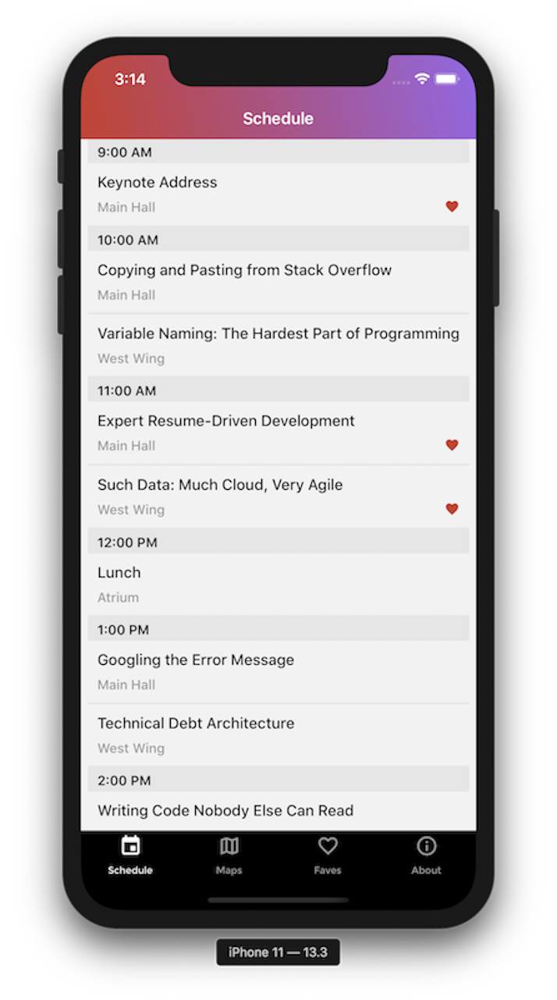
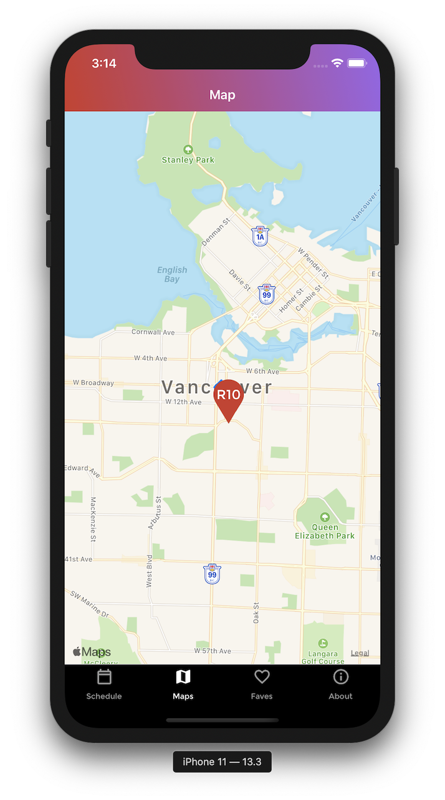
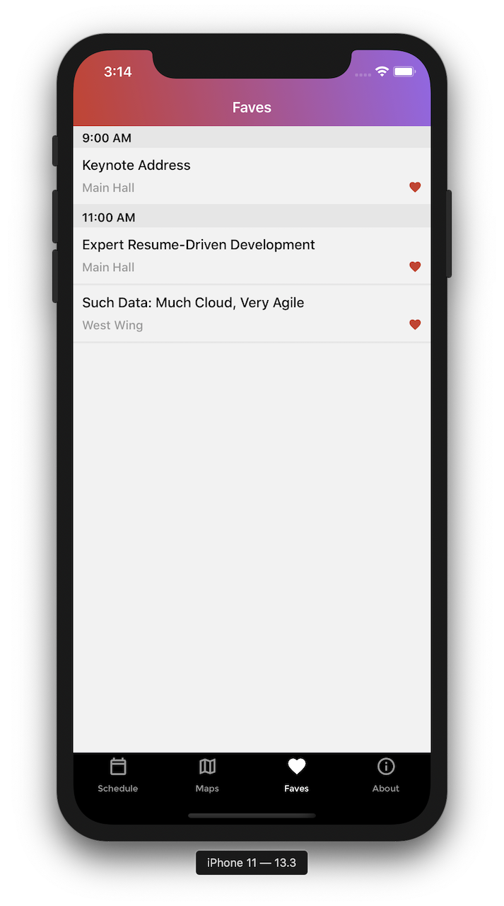
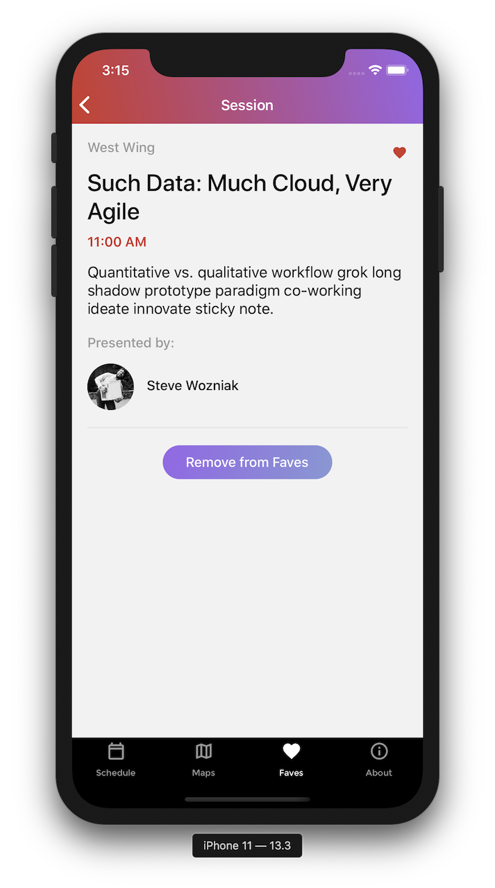
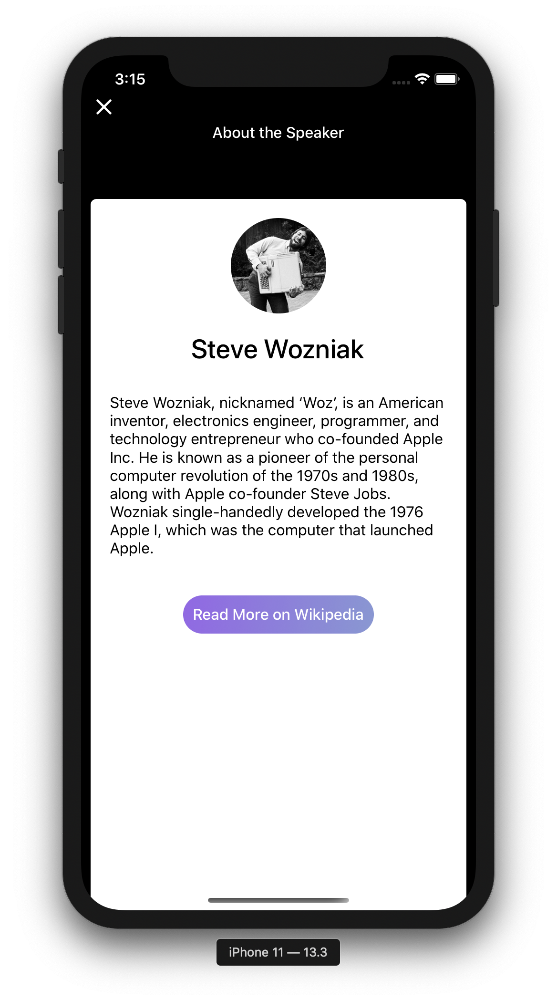

# R10 Project

A mobile application using React Native for an upcoming developer conference called R10.

# Screenshots

## Getting Started

To get started, fork or clone the repository and follow the instructions below.

### Prerequisites

- [React Native](https://facebook.github.io/react-native/)
- [Xcode](https://developer.apple.com/xcode/)
- [CocoaPods](https://cocoapods.org/)
- [Android Studio](https://developer.android.com/studio/)

### To Run

`yarn ios and/or yarn android`

## Technologies Used

- [React](https://reactjs.org/docs/hello-world.html)

- [React Native](https://facebook.github.io/react-native/)

- [GraphQL](https://graphql.org/)

- [XCode](https://developer.apple.com/xcode/)
- [Android Studio](https://developer.android.com/studio)

## Authors

**Ringo Wong**

LinkedIn: [Ringo Wong](https://www.linkedin.com/in/ringo-wong)
