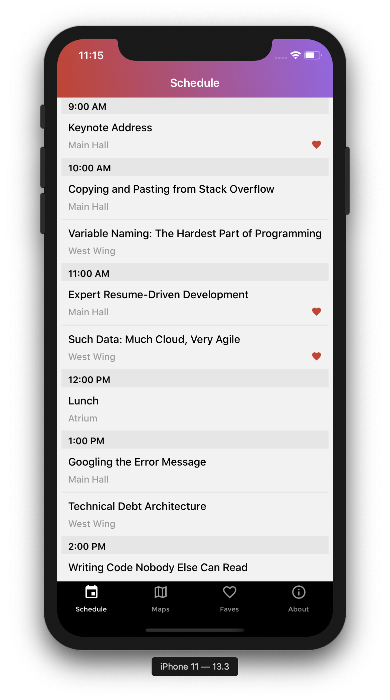
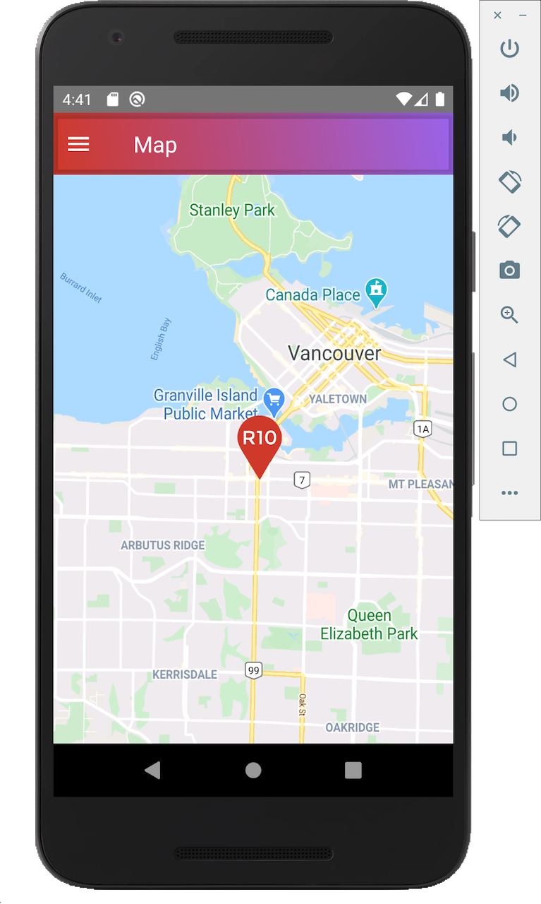

# R10 Project

A mobile application using React Native for an upcoming developer conference called R10.

Note: iOS is running Apple maps while Android is running Google maps.

# Screenshots

## Getting Started

To get started, fork or clone the repository and follow the instructions below.

### Prerequisites

- [React Native](https://facebook.github.io/react-native/)
- [Xcode](https://developer.apple.com/xcode/)
- [CocoaPods](https://cocoapods.org/)
- [Android Studio](https://developer.android.com/studio/)

### Installation

`yarn install`

`gem install cocoapods`
`cd ios`
`pod install`

### To Run

`yarn ios and/or yarn android`

## Technologies Used

- [React](https://reactjs.org/docs/hello-world.html)

- [React Native](https://facebook.github.io/react-native/)

- [GraphQL](https://graphql.org/)

- [XCode](https://developer.apple.com/xcode/)
- [Android Studio](https://developer.android.com/studio)

## Key Learnings

Increased understanding of how to use, style and animate React Native components and how they differ from React.

Gained better understanding of the perks and quirks of React Native as a cross-platform technology.

## Authors

**Ringo Wong**

LinkedIn: [Ringo Wong](https://www.linkedin.com/in/ringo-wong)
